# Design Invest Team CSCI-171 Fall 2023

**CS171 Design Sprint Process Book**

# WEEK 7

# **PROJECT NAME:**

# Invest Real Estate

# **ABSTRACT:**

The team will design a web visualization project of 10-14 interactive slides which would provide our audience a deep understanding of the recent movement patterns in critical macroeconomic variables (e.g., inflation, interest rates, GDP) and how they are affecting the investment performance and growth outlook for four commercial real estate sectors (residential, industrial, office and retail).

# **MOTIVATION AND PROBLEM STATEMENT**

Since the start of the global pandemic in early 2020, major macroeconomic movements have affected the global real estate economy in ways that would be evident and persistent for the next three to five years. Consider the volatility in residential asset prices as a result of falling and rising mortgage rates or the impact of hybrid work arrangements on the demand for office buildings. Multi-billion dollar real estate funds  devote a large part of their resources in researching and understanding these macroeconomic events to understand the effects on their portfolio as well as to allocate their buy and sell actions.

Our motivation to pursue this project stems from a desire and need to educate both technical and nontechnical audiences about where these markets have been and where they may be going. We plan to create a comprehensive set of easy-to-use advanced interactive web visualizations that will allow the user to understand the outcomes of these variables on four private equity real estate investment sectors.

We have also been able to procure a private equity company’s data that they are willing to let us use publically for our project. We will dedicate at least one full section of our visualization on presenting visualization as seen from the lens of a real private equity real estate fund.

# WEEK 8

# **TEAM AGREEMENT**

* We will coordinate the project design and development using the Slack group we have set up. We will conduct regular day-to-day communications through our team WhatsApp group.

* We will strive for an equal distribution of coding work among all members of the group. All code will be documented well.

* Final design decisions will be discussed among all members. We all agree to make reasonable compromises where necessary.

* Work hours will be split as evenly as possible. We agree that actual tasks and output may differ amongst us based on our individual ability, experience and expertise.

* We will ensure fairness in task allocation as well as equal learning opportunities for all three of us.

* It is agreed that we will work within our individual time constraints and schedules. It is also agreed that we will respect the course timelines, and furnish our promised work to our team within the stipulated time frame with at least a 48-hour notice to our teammates in case one of us is unable to furnish our task deliverable due to impeding personal circumstances.

* Work will not necessarily be done together through virtual team meetings, but regular communication and progress updates via WhatsApp will be made in a timely manner.

* We all agree to maintain a positive team culture while encouraging and respecting each other. We will use team voting on a disagreement as a first line course of action. We will report any conflicting opinion in our team to our TA mentor who may be able to guide us on an optimal resolution.

* **Signatures:** Elizabeth Koch, Jessica Gochioco, Naina Garg
* **Date:** October 30, 2023

# **PROJECT DETAILS**

* **Project Title:** Invest Real Estate
* **Team Name:** Design Invest
* **Team Members:** Elizabeth Koch, Jessica Gochioco, Naina Garg
* **Emails:**
    * elk677@g.harvard.edu
    * jeg607@g.harvard.edu
    * nag938@g.harvard.edu

* **Viz Organization:** Demonstrate Major Commercial Real Estate Investment Performance and Macroeconomic and Sector Themes

**<u></u>**

# **DETAILED PROJECT PLAN**

* **<u>Macroeconomic Themes:</u>**
    * **GDP Growth**

**Charts:**

1). OECD growth trends/forecasts

2). Per-capita GDP declines for the 4th consecutive quarter

**Textual Ideas:**

* Real GDP growth contracted by 0.2% in Q2/23 as the lagged effects of higher interest rates finally began to bite the consumers
* Base case is for a mild recession (in historic terms) with a few quarters of negative GDP (peak-to-trough 1.5%)
* Robust population growth has helped buoy the economy, but per-capita GDP has now declined for four straight quarters

* **Inflation**

**Charts:**

1). Headline and core inflation with forecast data (either using a deep learning model or publicly available forecasted data points)

2).  Labour data: Show leading indicators (e.g., unemployment, slow hiring activity)

**Textual Ideas:**

* Headline CPI is down to 4.0% from the high of 8.1% in 2022
* More importantly, core CPI measures have decelerated to 3.6% y/y; to 3.6% on a m/m 3-month moving average
* Paradoxically, excluding mortgage interest costs (driven largely by the Bank of Canada), inflation is below 3% which is within the BoC target range
    * **Interest Rates**

**Charts:**

1). Show the move in the long end of the curve ( to represent the current bear steeping)

2). Show volatility in the 5-year yield curve (because key to transaction activity revival would be lower volatility)

**Textual Ideas:**

* US Fed would lead and BoC is expected to remain on the sidelines, but a hawkish tone still persists
* Slowing inflation and a softening labor market reinforce the Fed’s and BoC’s jobs are likely done
* Long end of the yield curve tightening is also helping the banks (e.g., 10-year up 40bps from September 1st, 2023)
* BoC will be late to cut (market pricing expected in late 2024) so as not to reignite inflation, particularly in the housing markets
* Wage growth remains sticky as it typically lags not leads

* **<u>Private Equity Investment Performance</u>**

One or two slides with some of the following takeaways:

* Real estate income should be resilient given strong fundamentals and call for short and shallow recession
* CRE (Commercial Real Estate) capital markets revival is contingent on reduced bond market volatility
* Risks to the outlook include:
    * Central banks over-tightening
    * Domestic housing crash
    * Weak global growth and geopolitics

* **<u>Sector Outlook and Recommendations: Winners and Losers</u>**

(One slide on each)

* **Multi-family Residential:** Show rent growth trends and other variables (e.g., immigration putting pressure on housing prices, increase in housing prices)
* **Grocery-anchored retail:** Find data on leasing spreads
* **Industrial:**Rent-growth normalization (quarter-over-quarter data)
    1. **Data Centres:** Show absorption rates from datacenter hawk
    2. **Self-Storage:** Data is available but should we include this?
* **Office:** Show flight-to-quality

# **DATA AND DATA CLEANUP**:

We are currently in the process of data collection.

* We have identified several publicly available datasets that will illustrate the real estate market movements.
* We have also been able to procure a private equity company’s data that they are willing to let us use publically for our project. We will dedicate at least one full section of our visualization on presenting visualization as seen from the lens of a real private equity real estate fund.

The extent of data cleaning required may vary based on the datasets we choose to include in the project. However, given our previous and current experience in real estate economics, we do not expect this step of the project to be overly complex or even significantly time consuming. In the interest of proactive time management, we will, however, restrict ourselves to November 6 as our deadline for producing the final ready-to-deploy cleaned datasets.

# **EXAMPLE DATA SOURCES:**

**Inflation**

* [https://www150.statcan.gc.ca/n1/daily-quotidien/230919/dq230919a-eng.htm](https://www150.statcan.gc.ca/n1/daily-quotidien/230919/dq230919a-eng.htm)
* [https://www.bls.gov/cpi/](https://www.bls.gov/cpi/)

**Interest Rates**

* [https://www150.statcan.gc.ca/t1/tbl1/en/tv.action?pid=1010013901](https://www150.statcan.gc.ca/t1/tbl1/en/tv.action?pid=1010013901)
* [https://www.federalreserve.gov/releases/h15/](https://www.federalreserve.gov/releases/h15/)

**GDP:**

* [https://data.oecd.org/gdp/gross-domestic-product-gdp.htm](https://data.oecd.org/gdp/gross-domestic-product-gdp.htm)

**Employment Data**

* [https://www.statcan.gc.ca/en/subjects-start/labour\_](https://www.statcan.gc.ca/en/subjects-start/labour_)
* [https://www.bls.gov/](https://www.bls.gov/)

**Population Growth:**

* [https://www.statcan.gc.ca/en/subjects-start/population\_and\_demography/40-million](https://www.statcan.gc.ca/en/subjects-start/population_and_demography/40-million)
* [https://www.census.gov/newsroom/press-releases/2022/2022-population-estimates.html](https://www.census.gov/newsroom/press-releases/2022/2022-population-estimates.html)

**Articles and Other Sources**

* **Office**: Occupancy Rates [https://www.cbre.ca/insights/figures/canada-office-figures-q2-2023](https://www.cbre.ca/insights/figures/canada-office-figures-q2-2023)
* **Industrial**: Data Centers

[https://www.mckinsey.com/industries/technology-media-and-telecommunications/our-insights/investing-in-the-rising-data-center-economy](https://www.mckinsey.com/industries/technology-media-and-telecommunications/our-insights/investing-in-the-rising-data-center-economy)

* **Retail**: Grocery-anchored

[https://www.matthews.com/grocery-anchored-retail/](https://www.matthews.com/grocery-anchored-retail/)

* **Residential**: Mutlifamily [https://multifamily.fanniemae.com/news-insights/multifamily-market-commentary/2023-multifamily-market-outlook-turbulence-ahead](https://multifamily.fanniemae.com/news-insights/multifamily-market-commentary/2023-multifamily-market-outlook-turbulence-ahead)

# WEEK 9

# **PROJECT MAP:**

**Audience**

*Who is your audience? Come up with **at least three** options and pick one target audience*.

This project visualization hopes to engage both technical (i.e., small and large real estate investors) and non-technical audiences who appreciate and follow the real markets across the four asset class categories (industrial, residential, retail and office).

**<u>Audience Options:</u>**

1. **Primary Audience (technical):** This real estate investment market performance outlook 2024 would appeal most to the stakeholders of a real estate investment company which could include their portfolio managers, investors and researchers.

1. **Secondary Audience (non-technical):** This project should also appeal to any audience who have (or are interested in procuring) a real estate investment asset; we will capture movements in macroeconomic variables of interest (e.g., inflation, interest rates, MLS home price index, job switching rate, wage growth) that a small individual investor will be able to understand and appreciate.

1. **Tertiary Audience:** This project may appeal to a general audience who may be interested in learning more about the things that cause the real estate markets to fluctuate. For example, students may see this project as a source of information about the variables that a private equity real estate investor would care about.

*Describe your target audience in more detail. What do they know? What are their interests? What visualization literacy do they have? At what level of detail will you present information to them?*

1. **Target Audience - Knowledge and Interests:** Our target audience are real estate investors who would already understand the more nuanced variables and ideas that would be presented in this project. Their depth of knowledge and interest would accord with the advanced information served in this project.

1. **Visualization Literacy:** However, given the advanced visualizations that we aim to develop for this project, we expect them to find this project as a new and different experience of viewing information that would be traditionally served to them in static graphs.

1. **Information Depth and Density:** Given that the primary audience would already have sufficient information literacy, we believe we will be safe to show more advanced level detail but in digestible visualization formats (since their visualization literacy as their information literacy).

*What questions about your data will be interesting for your audience? Come up with a list of interesting questions that your audience may have about your data. The more, the better, but your team should come up with **at least ten questions**.*

Here we show our more than 10 questions bucketed under some of our major ideas:

1. **Recession:**How deep is the pending downturn? Are we finally in the most anticipated recession in history?
    1. What is the forecast on the trajectory of the downturn: peak to trough and its length?
    2. How is the labor market performing?
    3. How is a fatigued and indebted consumer behaving? Show financial distress metrics and retail sales
    4. What is the outlook for housing market correction in terms of sales prices and volume?
    5. Inflation Moderation: Is this the end of inflation? Is Inflation transitory?
        1. Is the trend of core and headline inflation trending in the right direction
        2. What are the components of inflation when we isolate for housing especially durable and discretionary goods that highlight that high interest rates are making their way into the real economy
        3. What are the development cost outlooks vis-a-vis inflation?

1. **Investment Performance:**Where are real estate values headed from here?
    1. What is the pace of asset values adjusting across asset classes?
    2. What is the difference in the private no versus public cap rates dislocation (intention is to show this difference as a leading indicator of private correction)
    3. **Interest Rates:**Is volatility in interest rates a deterrence to real estate investment sentiment?
        1. What has been the performance and investment activity in real estate during economic downturns and high-interest rates?
        2. What are the cap rate spreads across asset types?

1. **Sector Recommendations:**
    1. Where should real estate investors invest amongst the four commercial real estate sectors? How should they position their portfolios?
    2. Which are the best-performing asset classes?
    3. Where are the opportunities and which real estate sectors are more favored and why?
    4. Which sectors should investors avoid or sell?
    5. What strategies and levers should investors pull to actively manage their real estate portfolios?
    6. What is the current investor sentiment across various property types (grocery-anchored retail, multi-family, etc)? What are the key drivers for each?
    7. What are the key drivers and themes for data centers?
    8. What are the key drivers and themes for self-storage?

*What data do you have? Download the data you picked from the website linked in the PDF that describes the data (available on Canvas, week 2). Look at it in Excel or Google spreadsheet and briefly describe each attribute and its data type (categorical, ordinal, or quantitative) in your process book. It’s OK if you are unsure about the data type for some attributes - you can simply describe them (e.g., geographic location).*

1. **Data:** We have procured much of the data for the variables described above.

1. **Data Type**: All data variables are**quantitative and continuous** given that we are using GDP, inflation, interest rates, housing prices, asset prices, wages, transaction volume, and other such variables that are neither ordinal nor categorical or discrete.

1. **Screenshots:** Here are some screenshots of our data folders:

# **DATA VISUALIZATION WITH TABLEAU:**

**Naina Garg**
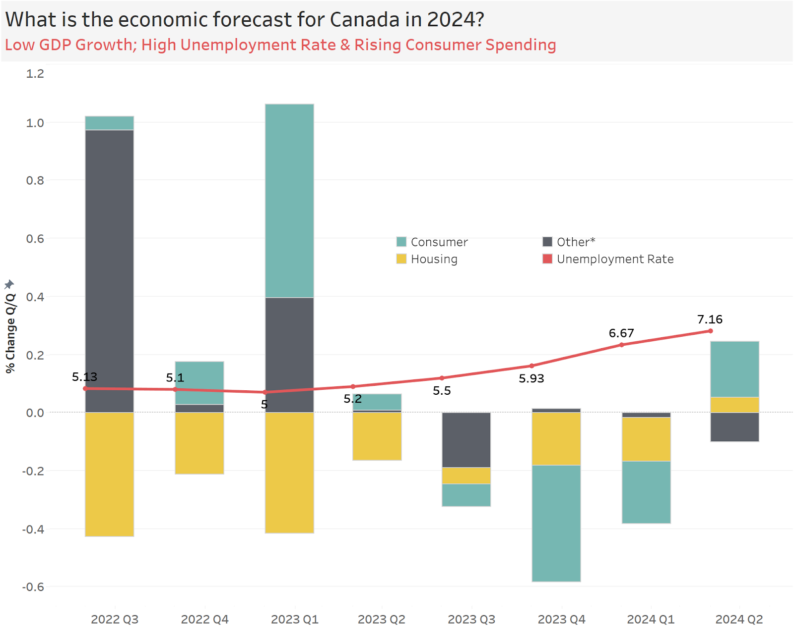
This is a forward-looking chart that shows that the unemployment rate has been forecast to get worse. Despite that, consumer spending will increase over time. The “other\*”, which measures GDP components such as net exports, government spending, and private business investment, is expected to continue being very low and even negative (i.e. tighter fiscal policy).

This visualization does address part of the question of “How is a fatigued and indebted consumer behaving? Show financial distress metrics and retail sales.” It shows that despite lower GDP and rising unemployment rate, consumer spending and housing prices are expected to increase and, in fact, improve. This is an important piece of insight for real estate investors as it provides insight into whether, for example, the retail buildings in their portfolios would still have high demand from existing and new tenants (tenants can include grocery store owners).
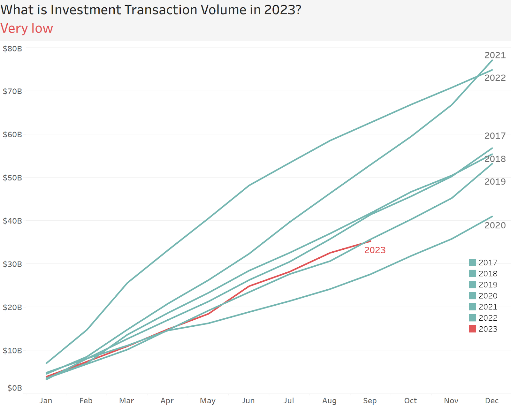
This graph shows that transaction activity in real estate has been very low in 2023 relative to previous years. Overall it has been a tough year for real estate funds, and this visualization demonstrates that.

It addresses the question: “What has been the performance and investment activity in real estate during economic downturns and high-interest rates?”.
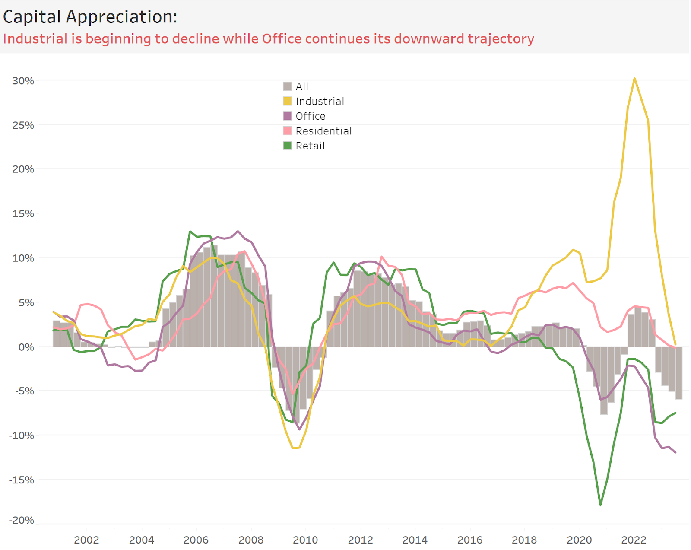
This graph shows the capital appreciation of properties in the four commercial real estate sectors and how it has varied over the years. This graph addresses a variety of questions we asked, especially: “Where should real estate investors invest amongst the four commercial real estate sectors? How should they position their portfolios?”.

One can see that the office sector has performed quite poorly since the onset of the pandemic in late 2020. Retail was much worse but it is showing signs of improvement. The industrial sector which includes assets such as warehouses and distribution centers performed exceptionally well during the same period although industrial now appears to be on a decline. This graph substantiates a critical argument that investors have always known: over time diversified portfolios generate higher risk-adjusted returns. One can see that investors who had a bulk of their capital invested in office probably lost a lot of their invested capital because office has performed very poorly in the last three years and is currently showing no signs of improvement.

**Elizabeth Koch**

My Tableau visualizations evolved from the team's broader questions to focus on specific areas: trends in home prices, core inflation over the years, and inflation by categories in recent years. This shift was driven by the data's clarity, which allowed for straightforward answers, like tracking the MLS Home Price Index changes, that directly interest our real estate-focused audience. Prioritizing simple and clear communication, the visualizations distill complex topics into accessible insights, like illustrating core inflation's long-term movement. Sticking to certain original questions ensured my visualizations remained aligned with the audience's key concerns around investment and market sectors. These visualizations, tailored and data-centric, offer precise analysis and a narrative that meets the audience's needs, rather than the team's broader exploratory questions.

**Jessica Gochioco**

This was an interesting experience to go through. The reason why my graphs differ from our questions is because although our ideas have no limit, what I could actually create and visualize is bounded by our data. I may have wanted to make comparisons between the four different sectors, but sometimes we’d be missing data for a sector so I would settle for just comparing two, like in the first graph. In the second graph, I was able to keep with the theme of helping investors with sector-based recommendations, but I deviated with the third graph because I found the staggering difference between renting and owning to be very powerful and really wanted to integrate it.

# WEEK 10

# **SKETCHES** AND **QUESTIONS:**

**Naina Garg**

**1) Where are real estate values headed from here?**

**2) What has been the investment performance and investment activity in real estate during economic downturns and high-interest rates?**
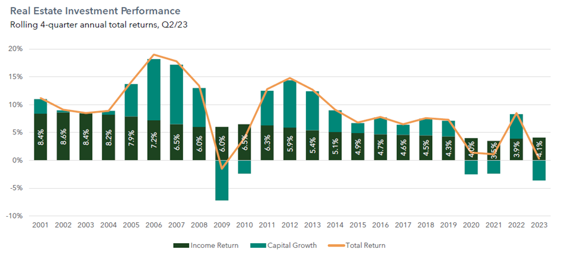
**3) What is the pace of asset values adjusting across asset classes and geographies in Canada?**
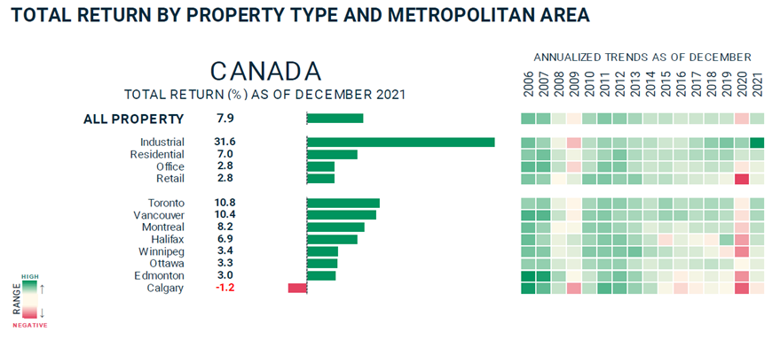
**4) What strategies and levers should investors pull to actively manage their real estate portfolios in terms of sector and sub-sector allocation? Demonstrate the benefit of diversification in relation to returns.**

**5) Which sectors should investors avoid or sell? What is the evolution in sector allocation in a real estate investor’s portfolio over the years as it relates to income return (yield) and total return?**
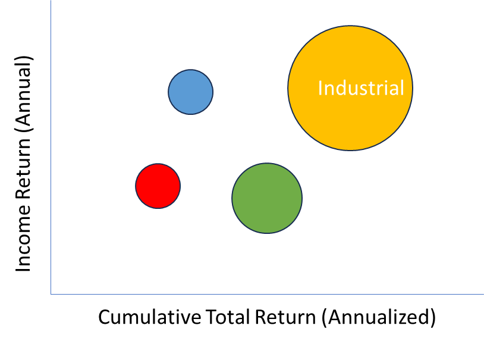

**Elizabeth Koch**

1. **How have vacancy rates evolved and trended in different commercial sectors over time? Which sectors should investors avoid or sell? Where are the opportunities and which real estate sectors are more favored and why?**
    1. 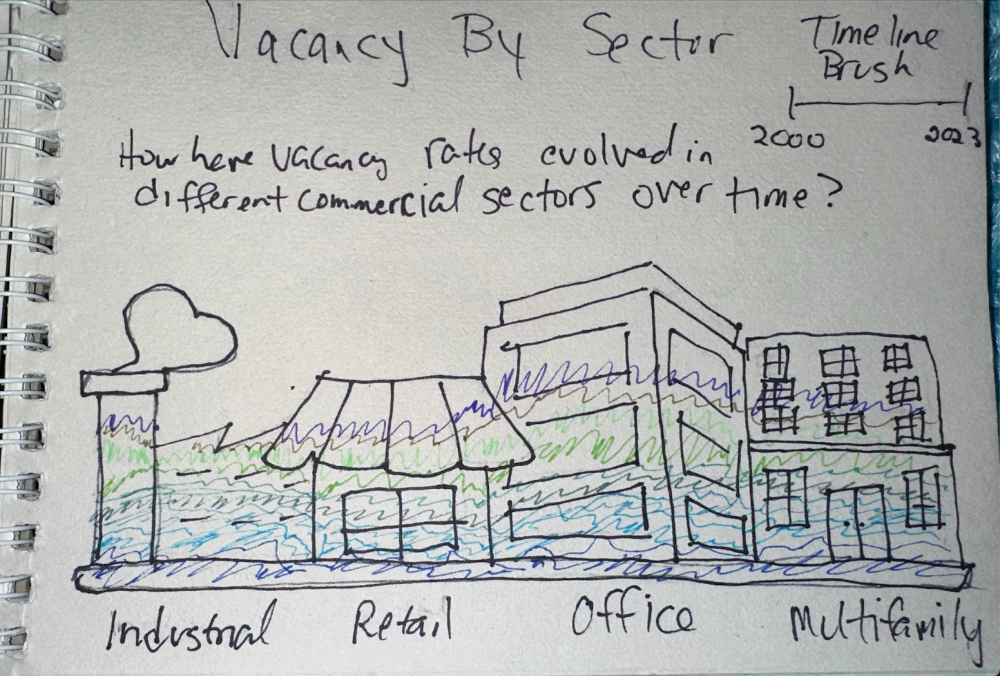
    2. 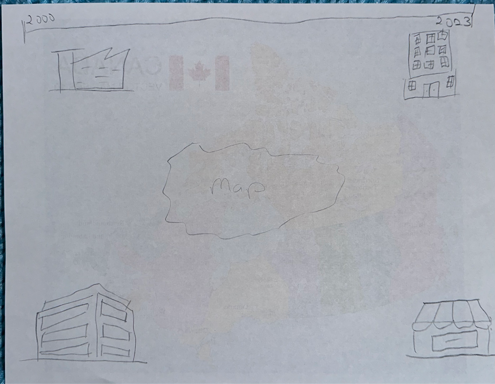 The sectors could be in line or separated across the page like the two above images.
2. **What is the impact of economic events on occupancy rates over time by region/market? Where should real estate investors invest amongst the four commercial real estate sectors? How should they position their portfolios?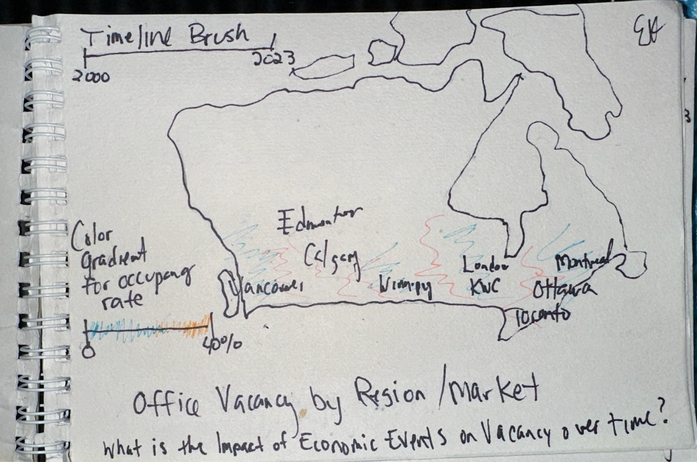**
3. **For the retail sector of commercial real estate, what is the distribution across the retail categories? What is the current investor sentiment across various property types (grocery-anchored retail, multi-family, etc)? What are the key drivers for each?**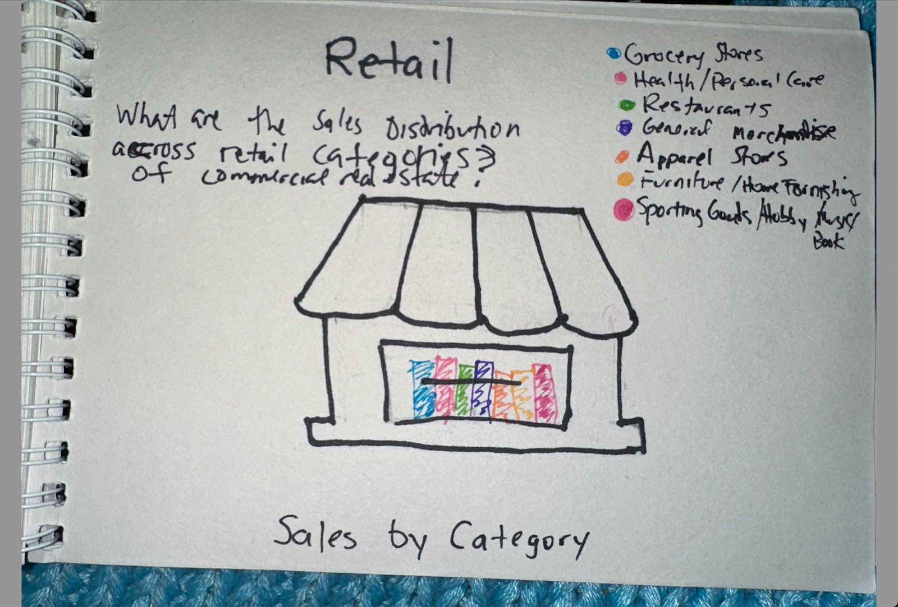
4. **What is the impact of economic events on current trends in industrial rents across markets? What are the key drivers and themes for data centers? What are the key drivers and themes for self-storage?**

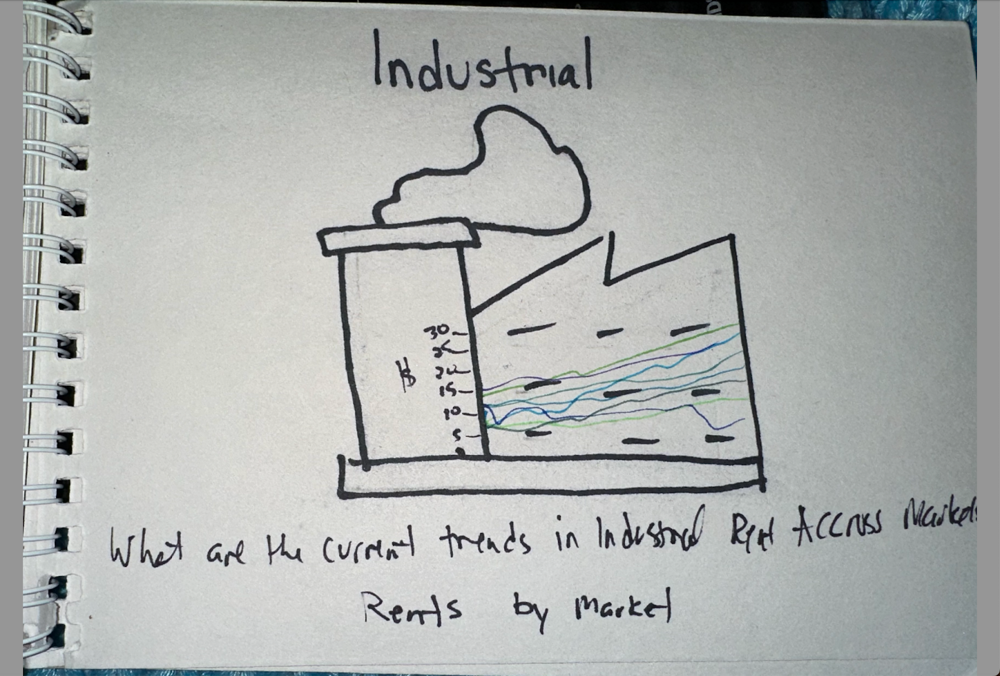
1. **How has the rental rate growth varied by region/market for multifamily real estate over time? What is the current investor sentiment across various property types (grocery-anchored retail, multi-family, etc)? What are the key drivers for each?**

**Additional sketches:**
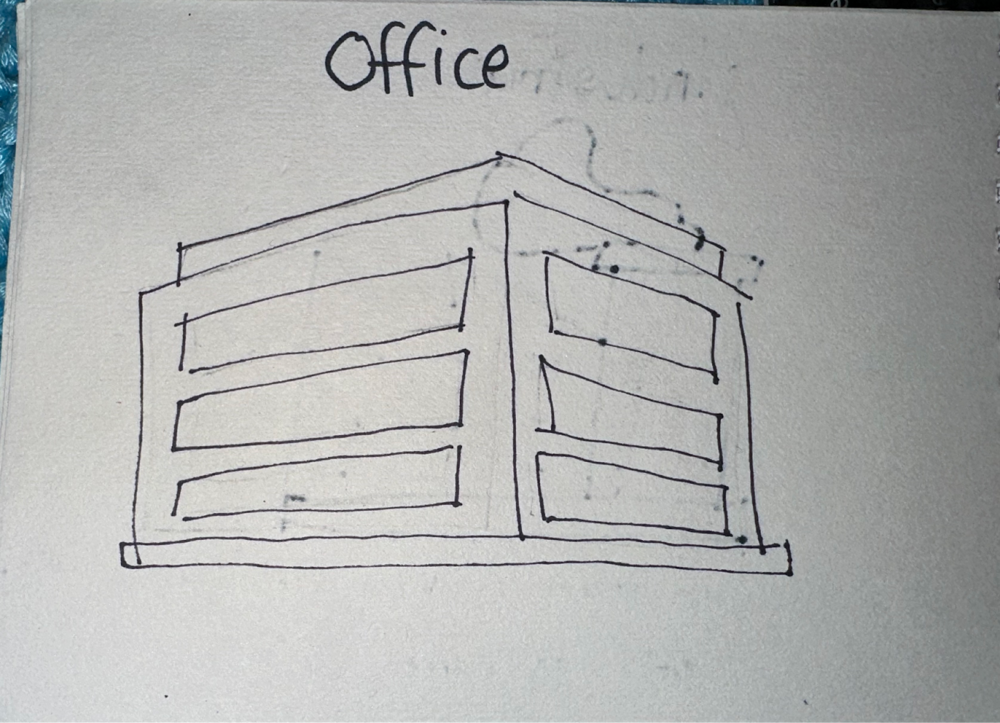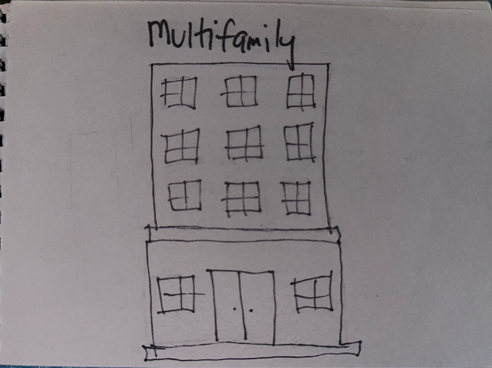

**Jessica Gochioco**

Sketch 1) **[1.1]**

**How is the pending downturn? What is the forecast on the trajectory of the downturn: peak to trough and its length?**

Sketch 2)  and Sketch 3) **[1.3]**

**How is a fatigued and indebted consumer behaving?**

Sketch 4) **[1.4]**

**What is the outlook for the housing market correction?**

Sketch 5) **[2.3]**

**Is volatility in interest rates (and subsequently mortgage rates) a deterrence to real estate investment sentiment?**
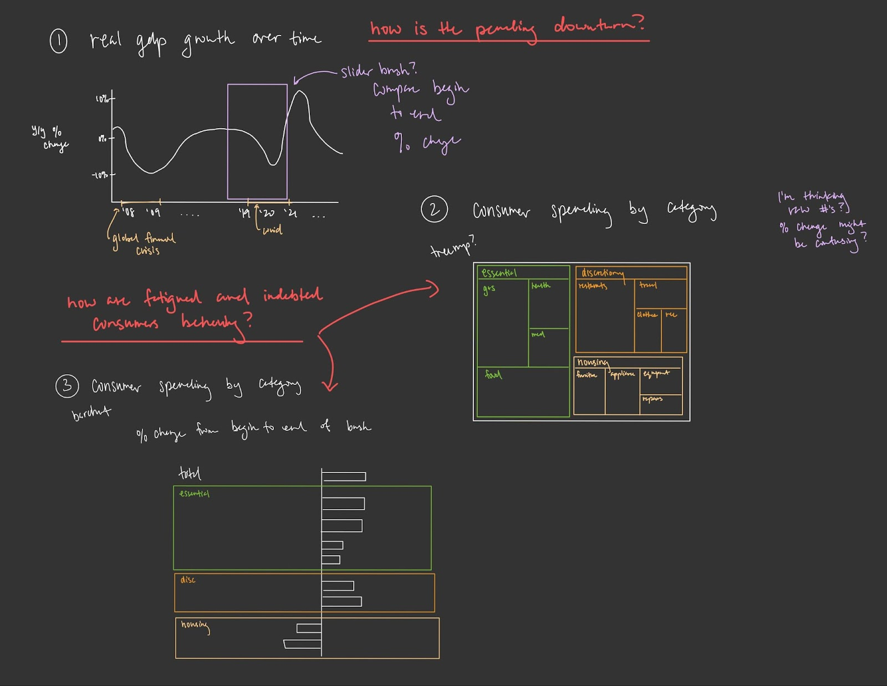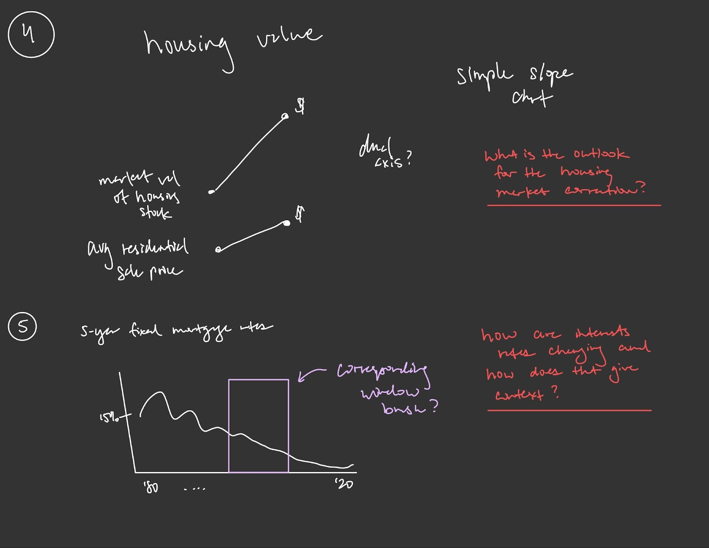
# VOTE AND **DECIDE :**

| <!----> | <!----> | <!----> | <!----> |
| --- | --- | --- | --- |
| **Sketch ID** | **Question ID** | **Author** | **Team Votes** |
| N1 | 2, 2.3.1 | NG | 1 |
| N2 | 2.1 | NG | 1 |
| N3 | 3.5 | NG | 2 |
| N4 | 3.4 | NG |  |
| E1 | 3.1, 3.2, 3.3 | EK | 3 |
| E2 | 3.1, 3.2, 3.3 | EK | 1 |
| E3 | 3.3, 3.6 | EK |  |
| E4 | 3.7, 3.8 | EK |  |
| E5 | 3.6 | EK | 1 |
| J1 | 1.1 | JG | 3 |
| J2 | 1.3 | JG |  |
| J3 | 1.3 | JG | 2 |
| J4 | 1.4 | JG |  |
| J5 | 2.3 | JG | 1 |

**One-paragraph explanation at the end summarizing our decisions and rationale for choosing the sketches we plan to implement:**

During voting, we prioritized visualizations that had interactivity, were simple and to the point, and showed data in a novel way. Although the instructions said to target only 4-6 visualizations, we plan on combining our choices into three separate themes (i.e., dashboards). Each team member’s 4-5 visualizations are based on one of the three themes and would be part of the one of the three dashboards based on the theme; each visualization in our three dashboards will be unique in terms of visual presentation and design.

# INSIGHTS:

**Naina Garg**

* **1). Bar and Line Graph (anchor timeline chart):** Income Return over the years has marginally declined in Canadian Commercial Real Estate (CRE). However, during times of economic slowdown (e.g., 2009, 2020-2021), capital growth and total return turned negative too while income return remained consistently positive throughout.
* **2). Combined Heat Map for Sector and Geography Bar Chart:** The heat map reveals that during recessionary periods, the total returns were negative for a majority of sectors and geographies in Canada. We present a diverging color scale with red indicating negative total investment returns and green representing positive total returns. As an example, Calgary has persistently produced negative returns interspersed with periods of high positive returns. 2006 and 2007 were the highest return years for investors across all sectors and geographies in Canadian CRE.
* **3). Diversification Map:** It reveals the sub-sector allocation of investor portfolios over the years. We note that the industrial sector over the years has steadily become a sector of choice with over 32% of CRE AUM allocated to it in 2023 versus under 18% in 2006.
* **4). Dynamic Bubble Chart:** This chart reveals the evolution of the four sectors over the years in terms of portfolio allocation as shown on income yields and cumulative total return axis.

**Elizabeth Koch**

* There's a noticeable correlation between GDP growth and increased activity in the commercial real estate sector.
* Employment growth across various industries is leading to changes in demand for commercial real estate.
* Increased population growth in major cities like Toronto and Vancouver is signaling a surge in demand for commercial real estate in these areas.
* There's a rising trend in office space vacancies, likely due to the ongoing shift to remote work.
* Lower vacancy rates in industrial and warehouse sectors could possibly be fueled by the growth of e-commerce.
* Variations in interest rates are having differentiated impacts on various segments of the commercial real estate market.

**Jessica Gochioco**

* **The COVID era is an unprecedented time:** No other time in our dataset have we seen such a stark change in real GDP growth. This has really “reset” the behaviors and preferences of society, which has a huge impact on CRE investment strategy.
* **We expect mortgage rates to stay higher:-** During COVID, we saw mortgage rates plummet as the Fed tried to keep the economy afloat, but we might not see rates that low ever again. This had a huge impact on housing, as housing prices have also skyrocketed.
* **Consumer spending is on the rise:** While we combat inflation and grapple with a recession, we also see that consumer spending is on the rise. This may be because so many Millennials who would’ve been buying housing can’t afford to do so, and so they shift their dollars to enjoy their present lives.

# 

# STORYBOARDING:

(This section and the sketch below were composed entirely by Elizabeth)

## **Main message**

Canadian commercial real estate is poised for significant growth in the post-pandemic era, fueled by evolving consumer behaviors and regional population growth.

The main message of our project is that the Canadian commercial real estate market is set to experience significant growth in the post-pandemic era, a development driven by evolving consumer behaviors and regional population growth. This central theme was chosen due to its strong relevance to both the current and future states of the market. Our in-depth analysis of the data revealed how the pandemic has significantly altered consumer habits and demographic patterns, particularly in major urban centers, which we refer to as the VECTOM cities.

Our rationale for this focus is rooted in the clear trends we observed: a recovery and growth across various commercial real estate sectors, heavily influenced by post-pandemic shifts in consumer behavior and population dynamics. These trends form the core of our visualizations, which are designed to depict this growth narrative. Our visualizations range from showing population trends in major cities to illustrating changes in consumer spending and the dynamics of different real estate categories.

The storyboard we've crafted aims to succinctly yet comprehensively convey these insights. It begins with an engaging hook to draw in the audience, followed by an exposition of the market's state before the pandemic. Then we delve into specific insights, including consumer behavior changes, population growth in key cities, and sector-specific trends like fluctuations in vacancy rates and retail real estate shifts. We highlight our main message within this narrative, emphasizing the market's potential for growth in the post-pandemic period, supported by data-driven visualizations. The storyboard culminates with a look at future market predictions and a concluding summary. This structured approach ensures a coherent narrative flow and a comprehensive presentation, effectively demonstrating the potential of the Canadian commercial real estate market in this new era.

## **STORYBOARD SKETCH**

# WEEK 11 

# PROTOTYPE 1:

* **Name of students that worked on prototype V1 submission**
    * Naina Garg
    * Elizabeth Koch
    * Jessica Giochoco
* **Outline of Steps Taken:** During this stage, the team did the following:
* **Data scraping and cleaning complete**
    * We have edited and cleaned the datasets that are and will be used in the project, using Python as well as Javascript.
    * Further adjustments not related to cleaning, if necessary, such as making objects with properties for each observation, will be made to make the data more convenient for visualization, during the creation of the visualizations as part of the natural process of building them.
    * All our cleaned data files can be found in the Google Drive for this project which is shared with the course staff as well as in the prototype 1 zip submission.
* **Project Scaffold and Proposed Layout**
    * We created an initial design for the project with the final storyboard, in the form of a Webstorm project which is submitted as Prototype 1.
    * The images in the Prototype 1 are placeholders. Titles and subtitles are further used to indicate the Storytelling aspect of the project, in a clear “So what” format..
    * We further describe below Interactions (brush, selection tabs, animation) below for each visualization. To make things easy to view, we’ve show a breakdown of our project scaffold below with explanation for each of the 6 sections (and subsections):
    * **Navigation Bar  :**
    * **Introduction:**
        * * Since this project is based on real estate markets in Canada, the cover page would have an dynamic map of Canada and the title of our project
            * Executive Summary: This subsection would host our presentation video.
    * **Dashboard 1 - Macroeconomics:**This single section would provide the overarching story of the Canadian investment landscape as it relates to significant variables such as
        * GDP (this graph would have a brush),
        * Consumer Spending (this graph would be divided into three sections)
        * Housing Prices for housing stock and average housing sale price
        * Mortgages Rates or Unemployment Rate or both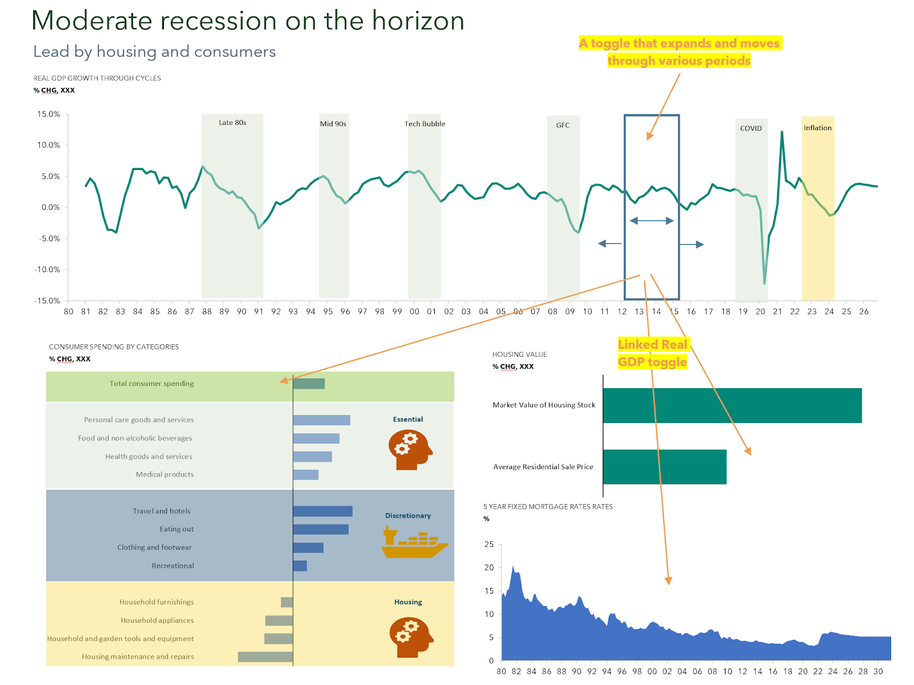
    * **Dashboard 2 - Investment Performance:**This section would be divided into two subsections:
        * **Animation Graph:** This shows income and total returns by sector and markets (the user would be able to select between sector or market and play, pause and resume the animation year by year.
        * **Interactive Brush Plots:** This 2nd subsection would tell the story of the income returns, total returns and capital growth with the anchor plot as shown being the brush plot. We may add another plot in this subsection to show the possibilities with D3 visualization.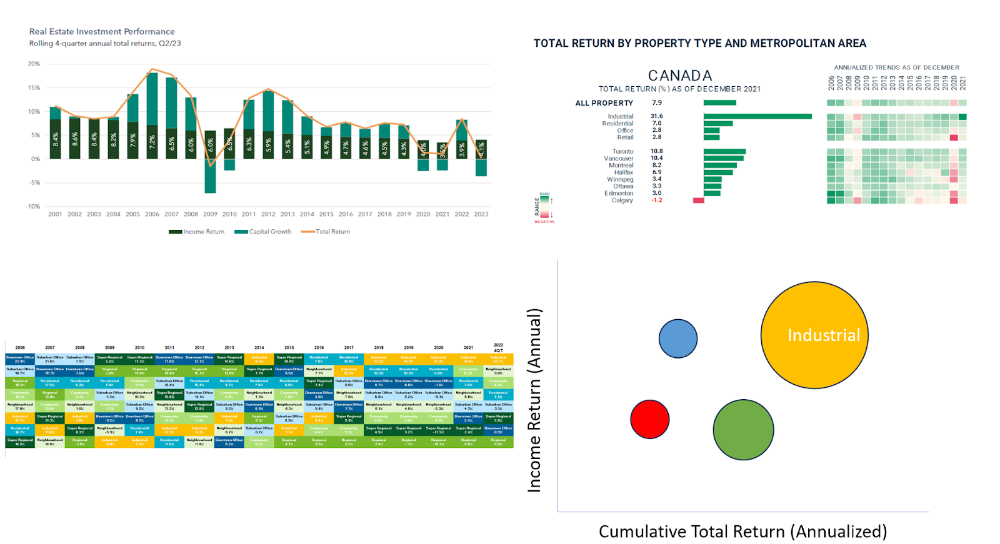
        * **Dashboard 3 - Real Estate Sectors:**This section would be divided into up to five possible simple yet information subsections:
            * Map of Canadian markets in center and sectors in the corner:
            * Sector 1 - Retail
            * Sector 2 - Residential
            * Sector 3 - Industrial
            * Sector 4 - Office

Each of the sector graphs would show (and explain with short commentary) how sector specific variables are affecting that sector’s outlook
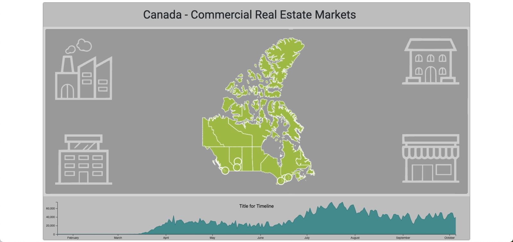
* **Recommendation**

* **Acknowledgements and References:** We will end our web visualization here.

**<u>Prototype 1 Visualizations</u>**

* **Visualization 1:*First design of an innovative view** *
    * Animated visualization:  This visualization forms part of Dashboard 2 described earlier in this section. You can play, pause, resume, play again, and play by year only with tooltips and dynamic tooltips for each sector.
    * Next we will add six markets of interest in Canada to this visualization.

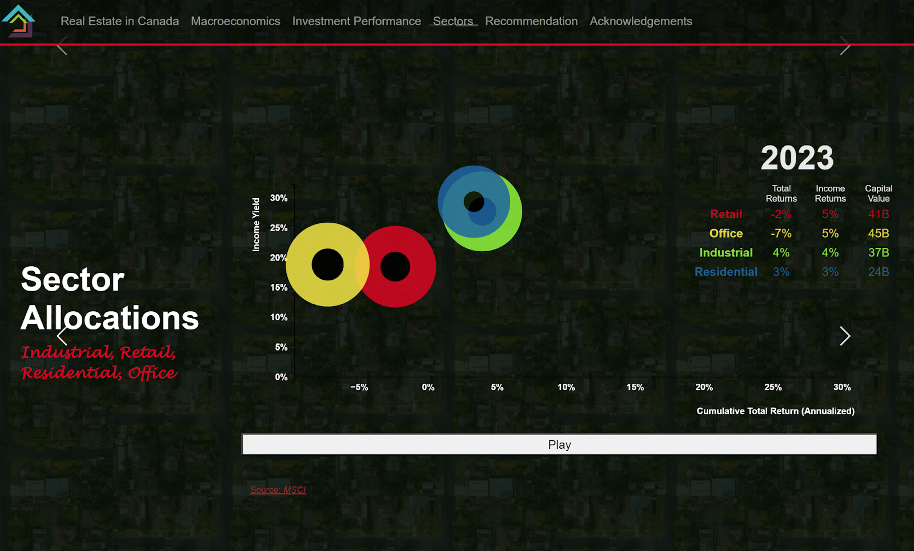
* **Visualizations 2 & 3  **
    * These two visualizations are work in progress and will be used as Dashboard 1 and 3 described earlier in this section.

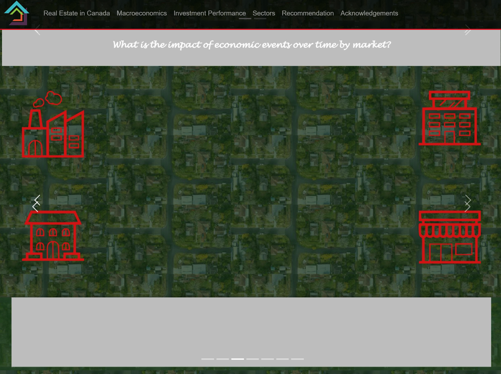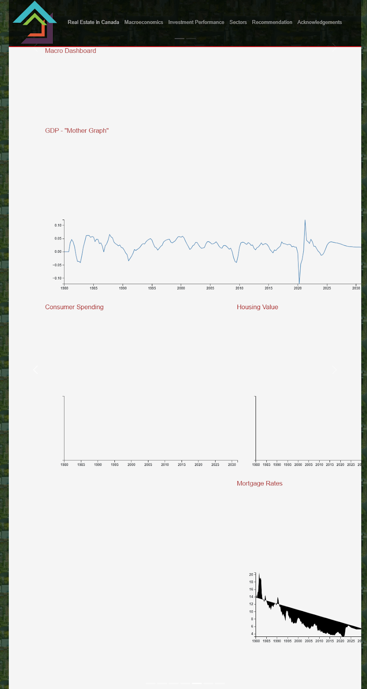
* **Final Comments:**
    * Each member created one visualization with Naina’s being related to investment performance, Jessica’s being based on the macroeconomic dashboard showing historical GDP since 1980 to 2023 and Elizabeth’s sector outlook showing the movements of the four real estate sectors and how they have been affected by various sector-specific variables such as rent growth, vacancy rates etc.
    * Naina’s visualization has the innovative aspect of being a play, pause, resume, play again and view by year animation feature for the investment returns observed in Canada’s real estate markets since 2001. This has not been done in Tableau during our course and we wished to implement it to expose another use case in Javascript with D3.

# WEEK 12

# PROTOTYPE 2:
